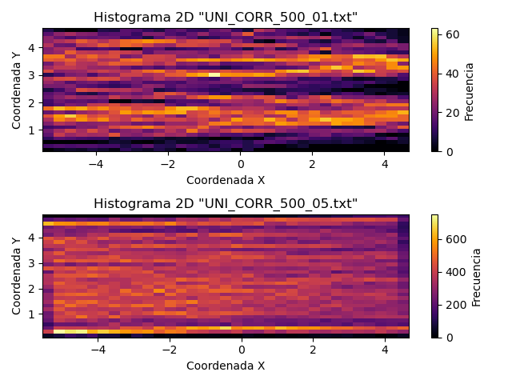
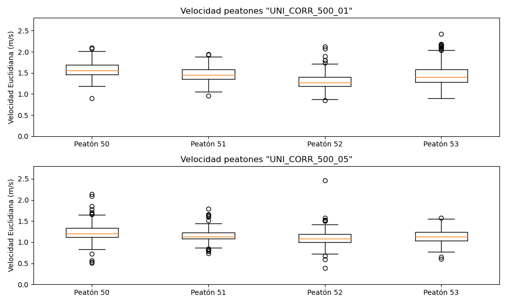

# Laboratorio 03: 

## 1. Introducción 

El estudio del flujo de personas en espacios unidireccionales podría tratarse de un tema fundamental para la planificación urbana y la gestión de multitudes ya que entender cómo se mueven las personas podría garantizar la seguridad, eficiencia y comodidad en diversos escenarios. En este informe, se presenta la primera parte del desarrollo para abordar el dicho problema, con los datos recopilados, los cuales contienen las coordenadas en metros que describen la ruta seguida por las personas, las cuales serán transformadas posteriormente a píxeles, lo que permitirá calcular una matriz de frecuencia que represente la ruta seguida por las personas en términos de píxeles. Para posteriormente graficar los datos a través de un histograma en 2D y realizar el cálculo de las velocidades con la que transitan los peatones por el pasillo.

### 1.1 Justificación 

En situaciones como evacuaciones de emergencia, eventos deportivos o festivales musicales se requieren de una planificación cuidadosa que garantice la seguridad de las personas. La transformación de las coordenadas (X, Y) a píxeles es esencial para cuantificar y analizar de manera más precisa el recorrido de estas ya que con ello se puede construir una matriz de frecuencia con la cual se pueden implementar mapas de calor y así visualizar los patrones de densidad, dado que cada píxel representa una unidad de área y su intensidad de color se correlaciona con la magnitud de los datos en esa ubicación por lo que se mostraran aquellas áreas más transitadas, facilitando la identificación de áreas críticas que requieran intervenciones específicas, además, con el análisis de las velocidades, que aporta información importante de los desplazamientos individuales de los peatones, se podrá evaluar la eficiencia general del pasillo y el flujo en su conjunto, ayudando a determinar la configuración más optima.

### 1.3 Objetivos 

**Objetivo general**

Crear un histograma para cada data frame con las velocidades de los peatones.

 
**Objetivos específicos**

1. Obtener las velocidades de los peatones.
2. Comparar las velocidades entre distintos peatones con diagrama de cajas y bigotes.
3. Analizar y comparar los resultados obtenidos de los diagramas generados.

## 2. Marco teórico 

Python: Es un lenguaje de programación de alto nivel. Presenta una sintaxis clara y legible. Es un lenguaje versátil que se utiliza en una amplia variedad de aplicaciones.

Visual Studio Code (VSCode): Editor de código fuente desarrollado por Microsoft.  Admite una variedad de lenguajes de programación, incluido Python, y proporciona funciones útiles como resaltado de sintaxis, autocompletado y depuración integrada.

NumPy: Es una biblioteca de Python ampliamente utilizada para realizar cálculos numéricos y operaciones con matrices y matrices multidimensionales. Introduce un objeto de matriz multidimensional llamado numpy.array, que permite realizar operaciones eficientes en grandes conjuntos de datos.

Matplotlib: Biblioteca de visualización de datos en Python que proporciona una amplia variedad de herramientas para crear gráficos estáticos, interactivos y animaciones.

Pandas: biblioteca de análisis de datos en Python que proporciona estructuras de datos flexibles y herramientas para manipular y analizar datos de manera eficiente.

## 3. Materiales y métodos

Los Data Sets utilizados en el laboratorio son archivos de texto descargados de “Pedestrian Dynamics Data Archive”, que contienen datos de coordenadas (x, y, z) que describen la ruta seguida por las personas en el corredor unidireccional. Cada línea del archivo representa una ruta individual con sus respectivas coordenadas.

El tamaño del Data Set dependerá de la cantidad de rutas registradas en el archivo y corresponderá al número de líneas presentes en el archivo, para el caso se utilizaron dos data sets, los cuales son UNI_CORR_500_01 y UNI_CORR_500_05, el primero cuenta con 25.536 datos. Mientras que el segundo tiene un total de 363.064 datos.

Descripción del Experimento:

El experimento consiste en analizar el flujo de personas en un pasillo unidireccional mediante el análisis de datos de coordenadas (x, y) proporcionados por los archivos de texto. Durante el proceso del laboratorio, se llevan a cabo diferentes operaciones como la lectura de los archivos, la exploración de los datos y la creación de los histogramas. 

Secuencia de Pasos:

Se inicia importando las librerías necesarias, en este caso Pandas, Matplotlib y NumPy (Lab 1), luego se cargan los documentos en un data frame utilizando Pandas, se le asigna un encabezado que sea representativo a cada columna de datos que contiene el TXT.  Con ello se utilizaron distintas funciones integradas en la librería para la exploración de los datos y tener un mejor entendimiento de estos. Una vez realizado esto con ayuda del data frame creado y la librería Matplotlib se generaron dos histogramas 2D con la frecuencia de las coordenadas X e Y para distintas medidas de los anchos de las puertas. Posteriormente se descompuso el data frame por peatones y se calculo la velocidad de cada uno en función a la distancia que tenían desde un frame al otro, con las velocidades se pudieron hacer comparaciones entre los mismo peatones ya que sea los de un mismo data frame o de otro a través de un gráfico de cajas y bigotes. Además, se logro hacer un histograma para comparar como frecuentaban las velocidades y así comparar las velocidades en función al ancho de las puertas.

## 4. Resultados obtenidos

|       Tipo de Experimento      | Tiempo de ejecucion (seg) |  Memoria utilizada (Mb) |
|--------------------------------|---------------------------|-------------------------|
|  Velocidad df                  | 0.0005004405975341797 seg | 142.73828125 MB         |
|  Velocidad df 2                | 0.009575605392456055 seg  | 142.73828125 MB         |

Tabla 1: Tiempo de demora cálculo de velocidades

Con respecto a la ejecución de la función que calcula las velocidades de los peatones en cada data frame, se aprecia que a pesar de que el segundo data frame contiene muchos mas datos ocupan la misma memoria a la hora de ejecutar el código, sin embargo, se ve un aumento de tiempo considerable debido a la vasta cantidad de datos que posee. Para ser mas concisos el tiempo de demora entre los caculos de cada archivo es mas de 10 veces mas grande en el segundo.

Imagen 1: Comparación HeatMaps

Para el estudio de flujo de personas en pasillos unidireccionales con diferentes tamaños de las puertas de entrada y de salida, se generaron dos histogramas 2D que muestran la distribución del flujo de personas en función de las coordenadas X e Y en el pasillo. Estos histogramas proporcionan la información sobre cómo las variaciones en el diseño del pasillo afectan el comportamiento de las personas y como circulan a lo largo del mismo.

En el primer histograma que contiene los datos del archivo con una puerta de entrada de 1 metro y una puerta de salida de 5 metros, se observa que el flujo de personas tiende a ser mayor en el centro del pasillo. Esto podría indicar que los individuos tienden a agruparse en el centro debido a la ubicación de las puertas de entrada y salida, lo que podría estar relacionado con la distribución asimétrica de las puertas. Además, se observa un punto en el inicio del pasillo, justo en el centro que está completamente negro, es decir, no está pasando nadie por ahí. Este punto parece ser el resultado de una obstrucción causada por una persona que se quedó parada en ese lugar, bloqueando el paso de los demás.

Para el segundo histograma se utilizaron los datos del archivo con una puerta de entrada de 5 metros y una puerta de salida de 5 metros, se observa que la distribución del flujo de personas es diferente en comparación con el primer histograma. Aquí, los colores fríos predominan, lo que indica que las personas se distribuyen más uniformemente a lo largo del pasillo. Esto podría sugerir que el diseño de las puertas de entrada y salida más amplias permite un flujo más fluido y sin obstrucciones. Aunque esta distribución uniforme es favorable en términos de un tránsito más ágil y eficiente, también podría significar un mayor uso de recursos y gastos debido a la necesidad de un espacio más amplio.

La elección del tamaño de las puertas debe ser el óptimo, que busque el equilibrio entre un flujo eficiente y los factores económicos y logísticos, ya que, si bien una distribución uniforme podría ser más eficiente desde el punto de vista del tránsito, podría requerir inversiones adicionales en espacio y recursos.

Imagen 2: Comparación peatones de forma individual

En la figura es posible apreciar la comparación de distintos gráficos de cajas y bigotes de la velocidad de 4 peatones al azar de cada archivo, donde la línea naranja de la caja indica la mediana de la velocidad (percentil 50%), en general no muestran una tendencia clara de diferencias significativas entre los dos conjuntos de datos. Se puede decir que el promedio de las velocidades de los peatones en el conjunto de datos UNI_CORR_500_01  son más altas que en los del conjunto UNI_CORR_500_05, esto se debe a que la mayoría de los peatones tienden a tener velocidades más altas en el primer conjunto de datos, además, los percentiles 25% y 75% también son más altos en el primer archivo en comparación al segundo, lo que refuerza la observación de que las velocidades son generalmente mayores para la puerta de entrada de 1 metro y la puerta de salida de 5 metros.

Si bien, ambos conjuntos de datos contienen valores atípicos en las velocidades de los peatones, el archivo UNI_CORR_500_01 tiene más valores atípicos que el otro conjunto para la mayoría de los peatones, lo que indica que el primero tiene velocidades más variables y extremas lo que podría deberse a que el pasillo con puertas de entrada de 1 metro provoca la necesidad de acelerar la velocidad, provocando además una mayor dispersión en ella dada la congestión y flujo irregular de los peatones en una entrada que es más estrecha y una salida más ancha, es decir, un flujo de entrada y salida desigual. Por el contrario, para el caso de puertas de 5 metros la velocidad promedio es más baja ya que es una entrada y salida igual, más amplia, donde los peatones tienen más espacio para moverse libre y cómodamente, lo que provoca valores atípicos menos pronunciados, lo que podría indicar una menor variabilidad en el comportamiento de los peatones ya que están más distribuidos.

En resumen, el análisis de las cajas y bigotes nos proporciona información importante sobre las distribuciones de velocidad de los peatones en diferentes escenarios, lo que podría influir en el comportamiento de las personas y en las distribuciones de velocidad observadas en cada conjunto de datos.

Imagen 3: Histograma de las velocidades en ambos data frames

Según la información extraída de los documentos se pudo hacer una comparación de la velocidades para ambos casos. En la parte superior tenemos la puerta de 1 y 5 metros respectivamente y en la parte inferior el pasillo con dos puertas de 5 metros.

A simple vista se ve que ambas contienen una distribución normal de los datos, se muestra un claro promedio y como se forma la campana de gauss.

Ahora se diferencian claramente en la velocidad media, en el primer caso es de aproximadamente 1.5 m/s mientras que en el segundo caso está por alrededor de los 0.5 m/s, esto puede deberse a diversos factores. Se destaca que en la segunda prueba eran muchas más personas las que pasaban por el pasillo, en comparación al primer muestreo.

Por otro lado, las personas al estar en un pasillo tan ancho deben ir al ritmo de las personas que van adelante, por lo cual hay un ritmo más homogéneo y lento, ya que los que van atrás no pueden adelantar a las demás personas debido a la aglomeración. En cambio, cuando entran por una puerta de un metro si bien pueden demorarse un poco más en entrar luego hay más espacio libre para que circulen y las personas tienden a caminar más rápido como se aprecia en el histograma.

## 5. Conclusiones

En este laboratorio es posible reconocer la relevancia de investigar y comprender el comportamiento y desplazamiento de las personas en distintos entornos. Esto se logra al examinar minuciosamente y de manera visual (mediante mapas de calor) los patrones de densidad en variados diseños de puertas de entrada y salida. Estos análisis revelaron aspectos fundamentales acerca de dicho comportamiento de los peatones. 

La utilización de herramientas como Python, Pandas, Matplotlib y NumPy evidenció su efectividad en el procesamiento y análisis de datos, exhibiendo cómo estas bibliotecas pueden mejorar la eficacia y comprensión del código. Estos resultados insinúan que la combinación de tecnologías para el análisis de datos y su visualización puede desempeñar una función de suma importancia en la toma de decisiones en la planificación y la creación de espacios seguros para la circulación de personas en diversas situaciones y eventos.

Los resultados obtenidos, mostrados en tablas y gráficos, desvelan patrones interesantes en el desplazamiento de personas según el tamaño de las puertas de entrada y salida. Se destacan diferencias notables en la distribución de velocidades y la conducta de los peatones en ambos escenarios examinados ya que en el caso de las puertas de 1 x 5 mts indican una variabilidad y extremos mayores debido a la necesidad de acelerar producto de la congestión por entrada estrecha y una salida amplia, lo que genera un flujo desigual. En contraste, en la configuración de ambas puertas de 5 mts, las velocidades son más homogéneas debido a una entrada y salida amplias y uniformes. Esto también se explica mediante los histogramas generados, ya que ambas presentan una distribución normal en los datos y cómo se forma las campanas de Gauss, la diferencia principal es la velocidad media: 1.5 m/s para la puerta de 1 metro y alrededor de 0.5 m/s para el pasillo con puertas de 5 metros que se debe a lo explicado anteriormente.

En última instancia, este estudio brinda una perspectiva detallada y cuantitativa sobre cómo el diseño del espacio impacta el comportamiento de los individuos en situaciones de flujo unidireccional, lo que podría desempeñar un papel crucial en la toma de decisiones de planificación y en la creación de espacios seguros y eficientes para la circulación de personas en diferentes eventos y situaciones.

