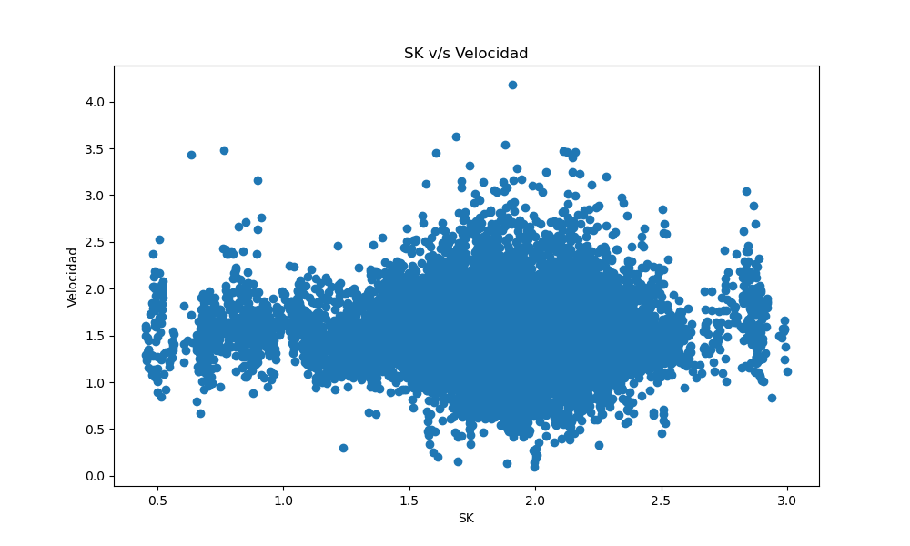

# Laboratorio 04: Cálculo de Sk y Vecinos más cercanos 

## 1. Introducción 

El estudio del flujo de personas en espacios unidireccionales podría tratarse de un tema fundamental para la planificación urbana y la gestión de multitudes ya que entender cómo se mueven las personas podría garantizar la seguridad, eficiencia y comodidad en diversos escenarios. En este informe, se presenta la primera parte del desarrollo para abordar el dicho problema, con los datos recopilados, los cuales contienen las coordenadas en metros que describen la ruta seguida por las personas, las cuales serán transformadas posteriormente a píxeles, lo que permitirá calcular una matriz de frecuencia que represente la ruta seguida por las personas en términos de píxeles. Finalmente calcular la distancia euclidiana entre los peatones y sus vecinos más cercanos como parte del análisis del comportamiento, con ello, cuantificar la separación entre los puntos en un espacio bidimensional (coordenadas X e Y de los peatones).

### 1.1 Justificación 

En situaciones como evacuaciones de emergencia, eventos deportivos o festivales musicales se requieren de una planificación cuidadosa que garantice la seguridad de las personas. La transformación de las coordenadas (X, Y) a píxeles es esencial para cuantificar y analizar de manera más precisa el recorrido de estas ya que con ello se puede construir una matriz de frecuencia con la cual se pueden implementar mapas de calor y así visualizar los patrones de densidad, dado que cada píxel representa una unidad de área y su intensidad de color se correlaciona con la magnitud de los datos en esa ubicación por lo que se mostraran aquellas áreas más transitadas, facilitando la identificación de áreas críticas que requieran intervenciones específicas, además, con el análisis de las velocidades, que aporta información importante de los desplazamientos individuales de los peatones, se podrá evaluar la eficiencia general del pasillo y el flujo en su conjunto, ayudando a determinar la configuración más optima.

### 1.3 Objetivos 

**Objetivo general**

Calcular las velocidades de los peatones dada su posición y la distancia euclidiana media de los vecinos más cercanos.

 
**Objetivos específicos**

1. Utilizar el método KDTree para identificar vecinos más cercanos a cada peatón en cada frame.
2. Generar un gráfico de dispersión de la distancia promedio vs. velocidad promedio.
3. Encontrar una función que se ajuste de manera óptima a los datos observados.

## 2. Marco teórico 

Python: Es un lenguaje de programación de alto nivel. Presenta una sintaxis clara y legible. Es un lenguaje versátil que se utiliza en una amplia variedad de aplicaciones.

Visual Studio Code (VSCode): Editor de código fuente desarrollado por Microsoft.  Admite una variedad de lenguajes de programación, incluido Python, y proporciona funciones útiles como resaltado de sintaxis, autocompletado y depuración integrada.

NumPy: Es una biblioteca de Python ampliamente utilizada para realizar cálculos numéricos y operaciones con matrices y matrices multidimensionales. Introduce un objeto de matriz multidimensional llamado numpy.array, que permite realizar operaciones eficientes en grandes conjuntos de datos.

Matplotlib: Biblioteca de visualización de datos en Python que proporciona una amplia variedad de herramientas para crear gráficos estáticos, interactivos y animaciones.

Pandas: biblioteca de análisis de datos en Python que proporciona estructuras de datos flexibles y herramientas para manipular y analizar datos de manera eficiente.

SciPy: biblioteca de Python que proporciona una amplia variedad de funciones y herramientas para tareas científicas y de ingeniería. Se construye sobre la biblioteca NumPy y extiende sus capacidades al proporcionar módulos adicionales para tareas como optimización, estadísticas, procesamiento de señales, álgebra lineal y más. 

curve_fit: Dentro del módulo scipy.optimize, la función curve_fit es una herramienta fundamental para el ajuste de curvas a datos experimentales o teóricos. El proceso de ajuste de curvas implica encontrar los parámetros de una función matemática que mejor se ajusten a un conjunto de datos observados. 

## 3. Materiales y métodos

El tamaño del Data Set dependerá de la cantidad de rutas registradas en el archivo y corresponderá al número de líneas presentes en el archivo, para el caso se utilizaron dos data sets, los cuales son UNI_CORR_500_01 y UNI_CORR_500_05, el primero cuenta con 25.536 datos. Mientras que el segundo tiene un total de 363.064 datos.

Descripción del Experimento:

El experimento consiste en analizar el flujo de personas en un pasillo unidireccional mediante el análisis de datos de coordenadas (x, y) proporcionados por los archivos de texto. Durante el proceso del laboratorio, se llevan a cabo diferentes operaciones como la lectura de los archivos, la exploración de los datos, la creación de los histogramas, creación de scatterplot y ajustes de curva para los datos.

Secuencia de Pasos:

Se inicia importando las librerías necesarias, en este caso Pandas, Matplotlib y NumPy y SciPY, luego se cargan los documentos en un data frame utilizando Pandas, se le asigna un encabezado que sea representativo a cada columna de datos que contiene el TXT.  Con ello se utilizaron distintas funciones integradas en la librería para la exploración de los datos y tener un mejor entendimiento de estos. Una vez realizado esto con ayuda del data frame creado y la librería Matplotlib se generaron dos histogramas 2D con la frecuencia de las coordenadas X e Y para distintas medidas de los anchos de las puertas. Posteriormente se descompuso el data frame por peatones y se calculó la velocidad de cada uno en función a la distancia que tenían desde un frame al otro, con las velocidades se pudieron hacer comparaciones entre los mismo peatones ya que sea los de un mismo data frame o de otro a través de un gráfico de cajas y bigotes. Además, se logró hacer un histograma para comparar como frecuentaban las velocidades y así comparar las velocidades en función al ancho de las puertas.

Por último, se debió obtener los parámetros para utilizar la formula de Weidmann donde se utilizarán las velocidades antes calculadas, el desafío implicado en esto es la obtención de SK por cada frame y por cada peatón, esto se llevó a cabo con un doble ciclo for en donde se obtuvo como referencia un peatón y se obtuvo la distancia que tenia respecto a los otros peatones en un radio de 3 metros. Con estos valores se suman las distancias de los vecinos en cada frame y se divide en la cantidad de vecinos y esto por cada frame y cada peatón. Toda la información se almaceno en un nuevo data frame para manipular los datos de manera óptima.
 
Ahora con el sk y las velocidades se creo un scatter plot para ver el comportamiento de los datos, finalmente se hizo un ajuste de curva a través de la función curve fit con una función logarítmica para ver si seguía este ajuste los datos presentes.

## 4. Resultados obtenidos

Imagen 1: Histograma de las velocidades en ambos data frames

Según la información extraída de los documentos se pudo hacer una comparación de la velocidades para ambos casos. En la parte superior tenemos la puerta de 1 y 5 metros respectivamente y en la parte inferior el pasillo con dos puertas de 5 metros.

A simple vista se ve que ambas contienen una distribución normal de los datos, se muestra un claro promedio y como se forma la campana de gauss.

Ahora se diferencian claramente en la velocidad media, en el primer caso es de aproximadamente 1.5 m/s mientras que en el segundo caso está por alrededor de los 0.5 m/s, esto puede deberse a diversos factores. Se destaca que en la segunda prueba eran muchas más personas las que pasaban por el pasillo, en comparación al primer muestreo.

Por otro lado, las personas al estar en un pasillo tan ancho deben ir al ritmo de las personas que van adelante, por lo cual hay un ritmo más homogéneo y lento, ya que los que van atrás no pueden adelantar a las demás personas debido a la aglomeración. En cambio, cuando entran por una puerta de un metro si bien pueden demorarse un poco más en entrar luego hay más espacio libre para que circulen y las personas tienden a caminar más rápido como se aprecia en el histograma.

Imagen 2: Scatter plot de SK v/s Velocidad

Del scatter plot no se puede obtener gran información, debido a la cantidad enorme de datos no se ve de manera clara si sigue alguna función, ya que solo parece una nube de puntos, lo único que se aprecia es la simetría de los puntos, es decir si trazamos una línea horizontal en esta nube de puntos los datos hacia arriba y hacia debajo de distribuirán de forma simétrica, sin embargo, también podemos notar la presencia de outliers. Para el caso se evaluó una función logarítmica para ver como se ajustaba la curva, dando así los siguientes resultados.

Imagen 3: Scatter plot de SK v/s Velocidad Ajustadob  

Claramente como se aprecia en la imagen la curva no sigue una función logarítmica, mas bien se ve como una función lineal, lo cual puede ser un indicativo que tanto la velocidad como SK se podrían representar a través de una regresión lineal, por lo que podríamos predecir la velocidad a través del SK haciendo su respectiva regresión, además abría que evaluar la calidad del modelo para ver si realmente sigue este ajuste, ya que hay una alta presencia de outliers.

## 5. Conclusiones

En este laboratorio es posible reconocer la relevancia de investigar y comprender el comportamiento y desplazamiento de las personas en distintos entornos. Esto se logra al examinar minuciosamente y de manera visual (mediante mapas de calor) los patrones de densidad en variados diseños de puertas de entrada y salida. Estos análisis revelaron aspectos fundamentales acerca de dicho comportamiento de los peatones.

La utilización de herramientas como Python, Pandas, Matplotlib y NumPy evidenció su efectividad en el procesamiento y análisis de datos, exhibiendo cómo estas bibliotecas pueden mejorar la eficacia y comprensión del código. Estos resultados insinúan que la combinación de tecnologías para el análisis de datos y su visualización puede desempeñar una función de suma importancia en la toma de decisiones en la planificación y la creación de espacios seguros para la circulación de personas en diversas situaciones y eventos.

El informe aborda este problema mediante la recopilación de datos de coordenadas que describen la ruta de las personas en términos de píxeles, permitiendo el cálculo de una matriz de frecuencia que representa esta ruta. Además, se calcula la distancia euclidiana entre los peatones y sus vecinos más cercanos para analizar su comportamiento. Para lograr cumplir el objetivo general el cual era calcular las velocidades de los peatones en función de su posición y la distancia media de los vecinos más cercanos, se plantearon objetivos específicos como la identificación de vecinos cercanos utilizando el método KDTree, la generación de gráficos de dispersión para relacionar distancia promedio y velocidad promedio, y encontrar una función que se ajuste a los datos observados. En los resultados obtenidos, se observó que las velocidades de los peatones variaban según el ancho de las puertas. La velocidad promedio en el pasillo con puertas más estrechas fue mayor que en el pasillo con puertas más anchas, posiblemente debido a la densidad de personas y la capacidad de movimiento. Se realizó un scatter plot para relacionar la distancia media de vecinos más cercanos (SK) con la velocidad y aunque inicialmente parecía no seguir una función clara, se probó aplicar distintos tipos de ajuste de curva, como función exponencial y logarítmica pero con ambas se obtuvieron líneas rectas, eso podría indicar que aunque los datos en sí mismos no sigan una tendencia lineal, al aplicar la transformación, los datos se aproximan más a esa relación. Ajustar una curva a estos datos que no presentan un patrón de tendencia claro resultó ser un desafío, ya que no hay una única función que capture todas las posibles variaciones en los datos, sin embargo, en base a todas las funciones probadas, creemos que ajustar una función polinómica de tercer grado (cúbica) fue la opción más razonable ya que aunque no es no lineal, una función polinómica de grado superior es mas compleja y es útil cuando los datos presentan una curva.

En última instancia, este estudio brinda una perspectiva detallada y cuantitativa sobre cómo el diseño del espacio impacta el comportamiento de los individuos en situaciones de flujo unidireccional, lo que podría desempeñar un papel crucial en la toma de decisiones de planificación y en la creación de espacios seguros y eficientes para la circulación de personas en diferentes eventos y situaciones.

